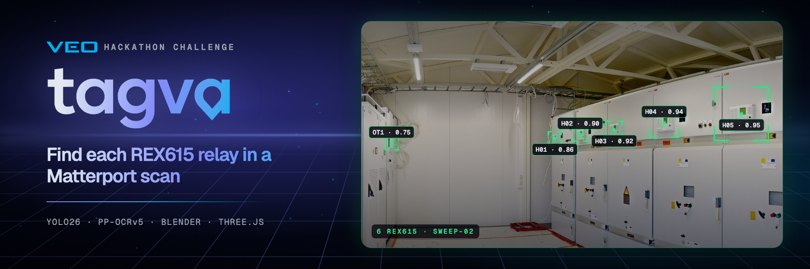
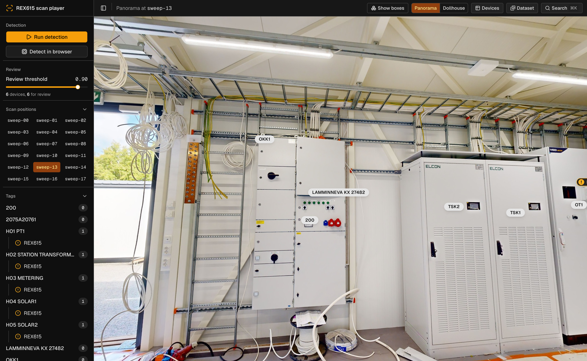

# Tagva

Tagva finds ABB Relion REX615 protection relays in a Matterport Pro3 scan of an electrical room. It reads the cabinet and device labels, puts a 3D tag on each device, and links the device documents. A web player shows the scan, the tags and the documents.

The project started at the VEO hackathon. VEO supplied the sample scan (`cloud_0.e57`).



## How it works

The operator types a project label and pushes one button. The pipeline then does these steps on each scan position:

1. Reproject the equirectangular panorama to 36 perspective tiles (1280 px, 60° FOV).
2. Find REX615 front plates on each tile with a single-class YOLO26 detector.
3. Find the cabinet labels with PP-OCRv5 text detection.
4. Read the device names and the cabinet labels with PP-OCRv5 recognition.
5. Cast a ray from the scan position through each box into the depth data. The hit point is the 3D anchor.
6. Merge the observations of one device across the scan positions (radius 0.2 m).
7. Attach each device to the nearest cabinet label (radius 2 m).
8. Link the documents. The device type selects the manual. The project label selects the drawings and the reports.
9. Set the review flags, for example `low_confidence`, `empty_ocr` and `no_anchor`.
10. Write the tag file. The player loads it again.

The player does not run the pipeline while the operator moves through the scan. The browser can also run the detector on the current view with onnxruntime-web. This check has no OCR and no anchors.

## Synthetic training data

No person labeled training images by hand. Blender renders the REX615 front plate from a rectified reference photo, and writes the YOLO labels directly. Each render changes the light, the view angle, the distance and the glass reflections. It also adds cables in front of the plate, blur, JPEG artifacts, random label text and random LED states.

The real REX615 devices in the VEO scan form a held-out test set. Training and tuning never use this set.

## Results

The selected model is `r2-mix-s` (YOLO26s, 6000 base images, 1500 dark images and 1500 heavy-occlusion images). On the VEO sample scan, it finds 6 of 6 devices with 0 false positives. The anchor error is 0.008 m to 0.020 m. A full run takes about 4 minutes on an M3 Pro.

Refer to `.planning/detector-runs.md` for all runs.

## Repository layout

| Path | Content |
| --- | --- |
| `pipeline/` | E57 ingest, tiles, detector, OCR, anchors, merge, cabinets, review, documents, tag file and the FastAPI service |
| `viewer/` | The web player: React, Tailwind CSS v4, shadcn/ui and Three.js |
| `synth/` | Blender synthetic data generator and texture preparation |
| `train/` | Ultralytics training and the Verda GPU instance tool |
| `eval/` | Real test set builder, evaluation and acceptance check |
| `docs/` | Document folder: `devices/<device_type>/` and `projects/<project>/` |
| `tests/` | pytest tests |
| `models/` | Detector weights (`*.pt` and `*.onnx` are not in git) |
| `data/` | Generated data: scan, tags, real test set, synthetic sets (not in git) |
| `.planning/` | Design notes and contracts |

## Requirements

- Python 3.12 for the pipeline. Refer to `pyproject.toml` for the packages.
- Python 3.11 with `bpy` 5.0.1 for the synthetic data.
- Node.js and npm for the player.
- The VEO scan file `cloud_0.e57` in the repository root.
- The detector weights in `models/rex615.pt`.

## Setup

Make the Python environment:

```sh
uv venv --python 3.12 .venv
uv pip install -r pyproject.toml
```

Get the panoramas, the depth data and the point cloud from the E57 file. The output goes to `data/scan/`:

```sh
.venv/bin/python -m pipeline.ingest cloud_0.e57
```

Install the player packages:

```sh
cd viewer
npm install
```

## Run

Start the API on port 8000:

```sh
.venv/bin/uvicorn pipeline.api:app --port 8000
```

Start the player in a second shell, then open http://127.0.0.1:5173:

```sh
cd viewer
npm run dev
```

These environment variables change the API paths:

| Variable | Default |
| --- | --- |
| `REX_E57` | `cloud_0.e57` |
| `REX_SCAN_DIR` | `data/scan` |
| `REX_WEIGHTS` | `models/rex615.pt` |
| `REX_TAGS_DIR` | `data/tags` |
| `REX_DOCS_DIR` | `docs` |
| `REX_SYNTH_DIR` | `data/synth` |
| `REX_OCR_WORKERS` | half the CPU count plus 1 |

## Player features

- Panorama view with jumps between scan positions
- Tag pins for cabinets and devices, with detection boxes
- Dollhouse view of the point cloud
- Device table and device details
- Document browser with manual search
- Tag editor for devices with a review flag
- Review threshold slider
- Gallery of the synthetic training data
- Detector check of the current view in the browser

## Train a new model

Prepare the plate texture from the reference photo:

```sh
.venv-bpy/bin/python synth/prep-texture.py
```

Render a synthetic data set:

```sh
.venv-bpy/bin/python synth/render.py --out data/synth/base-s0 --count 6000 --profile synth/profiles/base.json
```

Train the detector:

```sh
.venv/bin/python train/train.py --data data/synth/base-s0 --name r1-base-s
```

`train/verda.py` starts a GPU instance on Verda, renders and trains there, and copies the weights back. Use `--install` to copy `best.pt` to `models/rex615.pt`.

Measure the model on the real test set:

```sh
.venv/bin/python eval/build-real-test.py
.venv/bin/python eval/eval-real.py --weights models/rex615.pt
```

Export the model for the browser detector:

```sh
.venv/bin/python -c "from ultralytics import YOLO; YOLO('models/rex615.pt').export(format='onnx', imgsz=1280, opset=17, simplify=True)"
```

## Tests

```sh
.venv/bin/python -m pytest -m "not slow"
```

The `slow` tests need `cloud_0.e57` and the real models. They take some minutes.

## Deploy

Each push to `main` deploys the app to a Verda CPU server. The workflow `.github/workflows/deploy.yml` does these steps:

1. Build the viewer.
2. Copy `pipeline/`, `docs/`, `pyproject.toml`, `uv.lock` and `viewer/dist/` to `/srv/tagva/app` with rsync.
3. Install the Python packages with `uv sync --frozen`. On Linux, uv gets the CPU version of PyTorch.
4. Restart the `tagva-api` service and check `/api/projects`.

Caddy serves the viewer and sends the API paths to uvicorn. Caddy also gets the HTTPS certificate through ACME. The workflow uses these settings:

| Name | Type | Value |
| --- | --- | --- |
| `DEPLOY_SSH_KEY` | secret | Private key of the `tagva` user on the server |
| `DEPLOY_KNOWN_HOSTS` | secret | Host key of the server |
| `DEPLOY_HOST` | variable | Server IP address |
| `DEPLOY_URL` | variable | Public URL of the app |

The deploy does not copy the data. Copy the scan, the tags, the synthetic sets, the weights and the E57 file to `/srv/tagva/data` one time:

```sh
rsync -az data/scan data/tags data/synth cloud_0.e57 tagva@SERVER:/srv/tagva/data/
rsync -az models/rex615.pt models/rex615.onnx tagva@SERVER:/srv/tagva/data/models/
```

To prepare a new server, copy `deploy/` to the server and run the setup script as root:

```sh
bash deploy/setup-server.sh HOSTNAME DEPLOY_PUBLIC_KEY_FILE
```

## Tag file

The pipeline writes one tag file per project to `data/tags/<project>.json`. The file has one tag per cabinet and one `unassigned` tag if necessary. Each device has its boxes, its 3D anchor, its confidence, its documents and its review reasons. Refer to `.planning/contracts.md` for the full format.

In production, the tags go to the Matterport portal through the Matterport API. In this demo, the player replaces the portal.
